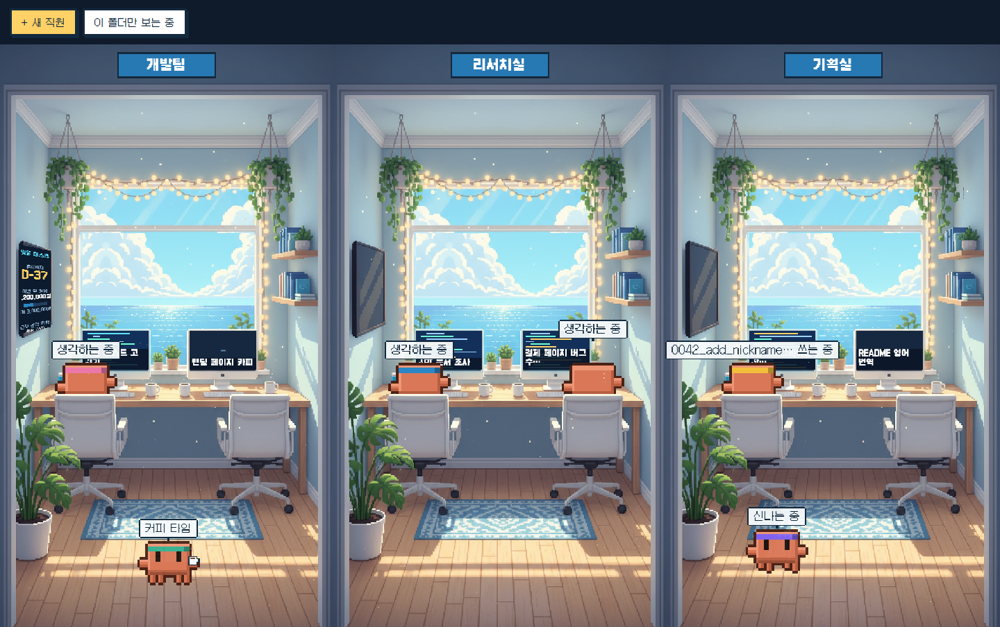
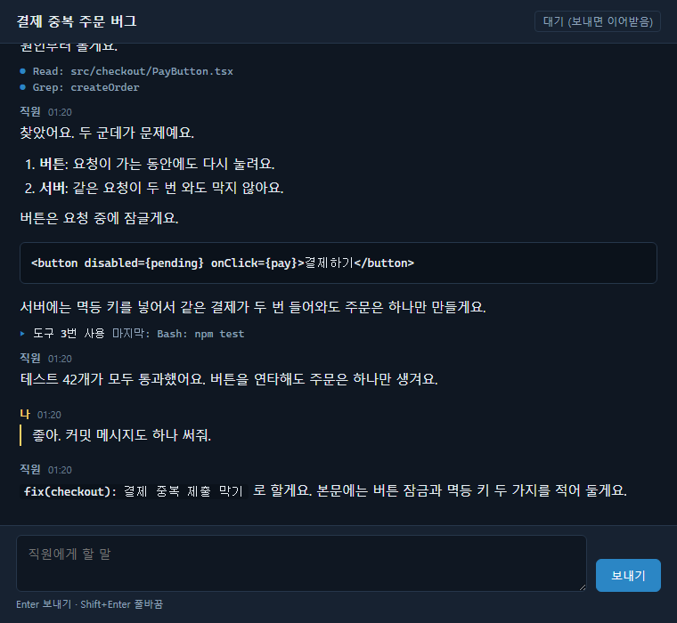
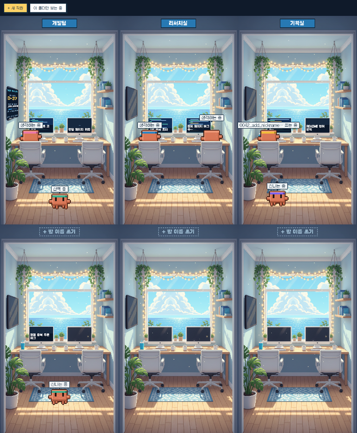
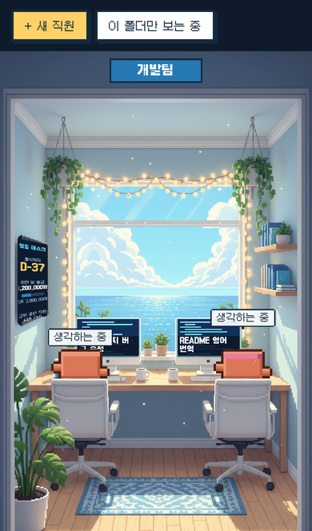
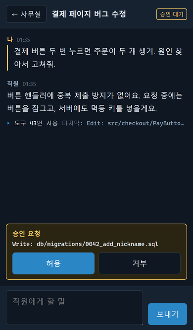

<h1 align="center">빛뜰 데스크 (Bitteul Desk)</h1>

<p align="center">
  Claude Code 세션이 사무실 직원이 되는 픽셀아트 대시보드.<br>
  직원을 누르면 그 세션의 대화 창이 열리고, 거기서 바로 답을 쓸 수 있어요.
</p>

<p align="center">
  <em>A pixel-art office where each Claude Code session is a staff member at a desk. Click one to read and reply in its own chat window.</em>
</p>



## 이런 걸 해요

- **세션마다 직원 한 명.** 지금 돌고 있는 Claude Code 세션이 책상에 앉아 일해요. 모니터에는 작업 제목이 뜨고, 머리 위에는 지금 하는 일(파일 수정 중, 웹 조사 중 등)이 떠요.
- **일이 끝나면 딴짓.** 할 일을 마친 직원은 의자에서 내려와 산책하고, 기지개 켜고, 낮잠 자고, 커피를 마셔요.
- **누르면 대화 창.** 직원을 누르면 그 세션의 대화가 별도 창으로 열려요. 터미널처럼 읽기 편한 화면이라 여러 개 띄워 놓고 일하기 좋아요. 도구 사용이 3번 이상 이어지면 한 줄로 접혀서 대화가 묻히지 않아요.
- **대시보드에서 바로 답장.** 대화 창에서 메시지를 보내면 그 세션이 이어서 일해요. 도구 사용 승인 요청이 오면 허용이나 거부를 누르면 돼요.
- **폰으로 밖에서도.** `--phone`으로 켜면 폰에서 사무실을 보고 지시와 승인까지 할 수 있어요. Tailscale을 붙이면 집 밖에서도 돼요.
- **새 직원 부르기.** 왼쪽 위 **+ 새 직원** 버튼으로 새 세션을 시작해요.
- **층 늘리기와 자리 바꾸기.** 방 3개에 6자리가 한 층이고, 세션이 늘면 아래로 층이 생겨요. 직원을 꾹 눌러 끌면 자리를 옮기고, 다른 직원 자리에 놓으면 둘이 자리를 바꿔요.
- **방 이름표.** 방 위 이름표를 누르면 이름을 쓸 수 있어요. 자리와 이름은 다시 켜도 그대로예요.

| 대화 창                               | 세션이 늘면 층이 생겨요                      |
| ------------------------------------- | -------------------------------------------- |
|  |  |

## 준비물

- [Node.js](https://nodejs.org) 20 이상
- [Claude Code](https://docs.anthropic.com/en/docs/claude-code) 설치와 로그인. 터미널에서 `claude`가 실행되면 준비된 거예요.

## 설치하고 켜기

Claude Code를 쓰는 프로젝트 폴더에서 아래 한 줄을 실행하세요. 설치 과정 없이 바로 켜져요.

```bash
cd 내-프로젝트-폴더
npx https://github.com/Yewon419/bitteul-desk/releases/download/v0.1.1/bitteul-desk-0.1.1.tgz
```

켜지면 브라우저가 자동으로 사무실 화면을 열어요. 브라우저가 안 열리면 터미널에 찍힌 `Bitteul Desk office:` 주소를 직접 여세요. 끌 때는 터미널에서 **Ctrl+C**를 누르면 돼요.

매번 긴 주소를 치기 싫으면 전역으로 설치해 두세요.

```bash
npm install --global https://github.com/Yewon419/bitteul-desk/releases/download/v0.1.1/bitteul-desk-0.1.1.tgz
bitteul-desk
```

## 쓰는 법

1. 평소처럼 터미널에서 `claude`로 작업하세요. 같은 폴더의 세션이 몇 초 안에 직원으로 나타나요.
2. 직원을 누르면 대화 창이 열려요. 브라우저가 팝업을 막으면 화면 아래에 뜨는 링크를 누르거나, 주소창 오른쪽의 팝업 차단 아이콘에서 이 주소를 허용해 주세요.
3. 대화 창에서 **Enter**는 보내기, **Shift+Enter**는 줄바꿈이에요. 폰에서는 Enter가 줄바꿈이고 **보내기** 버튼으로 보내요.

**터미널에 열려 있는 세션은 보기 전용이에요.** 두 곳에서 한 세션에 동시에 쓰면 대화가 꼬여서 막아 뒀어요. 터미널에서 그 세션을 닫으면 대시보드에서 이어받아 답할 수 있어요. 대시보드에서 **+ 새 직원**으로 시작한 세션은 처음부터 대시보드에서 주고받아요.

## 옵션

```bash
bitteul-desk --port 3100      # 포트 고정 (기본은 빈 포트 자동 선택)
bitteul-desk --no-open        # 브라우저 자동 열기 끄기
bitteul-desk --host 127.0.0.1 # 접속 주소 (기본값)
bitteul-desk --phone          # 폰 접속 모드 (아래 '폰으로 밖에서 지시하기')
bitteul-desk --help
```

- **다른 폴더의 세션까지 보고 싶을 때:** 사무실 화면 왼쪽 위의 **이 폴더만 보는 중** 버튼을 누르면 **모든 폴더 보는 중**으로 바뀌어요. 최근 10분 안에 움직인 다른 폴더의 세션이 몇 초 안에 나타나고, 이 설정은 다시 켜도 유지돼요.
- **`claude`를 못 찾는다는 오류가 날 때:** 환경변수 `BITTEUL_CLAUDE_EXE`에 claude 실행 파일 경로를 넣고 다시 켜세요.

## 폰으로 밖에서 지시하기

폰 브라우저로 사무실을 보고, 직원을 눌러 대화를 읽고, 답장하고, 승인까지 할 수 있어요. 폰에서는 방이 한 줄로 세로로 쌓이고, 대화는 같은 탭에서 열려요. 왼쪽 위 **← 사무실**을 누르면 돌아와요. 직원을 꾹 눌러 끄는 자리 바꾸기도 손가락으로 돼요.

| 폰 사무실                                            | 폰 대화 창                                                 |
| ---------------------------------------------------- | ---------------------------------------------------------- |
|  |  |

### 1. 같은 Wi-Fi에서 먼저 확인

```bash
bitteul-desk --phone
```

터미널에 폰용 주소와 QR 코드가 찍혀요. 폰 카메라로 QR을 찍으면 바로 열려요. 이 모드는 토큰을 `~/.pixel-agents/bitteul-desk-phone-token`에 저장해 두고 다시 켜도 같은 걸 써요. 그래서 폰에 즐겨찾기하거나 **홈 화면에 추가**해 두면 계속 쓸 수 있어요.

### 2. 밖에서도 되게: Tailscale

집 밖에서 접속하려면 PC와 폰을 잇는 통로가 필요해요. [Tailscale](https://tailscale.com/download)을 추천해요. 개인 사용은 무료고, 내 기기끼리만 암호화된 길로 연결돼요.

1. PC와 폰에 Tailscale을 설치하고 같은 계정으로 로그인하세요.
2. `bitteul-desk --phone`을 다시 켜세요. Tailscale 주소(`100.`으로 시작)가 맨 위에 뜨고, QR도 그 주소로 바뀌어요.
3. 폰에서 그 주소를 열어 두면 LTE로 밖에 있어도 들어와요.

처음 켤 때 Windows 방화벽 창이 뜨면 허용해 주세요. Cloudflare WARP 같은 다른 VPN을 같이 쓰고 있는데 주소가 안 열리면, 그 VPN을 잠깐 끄고 확인해 보세요.

### 밖에서 지시하기 전에 알아둘 것

- **터미널에 열려 있는 세션은 폰에서도 보기 전용이에요.** 나가기 전에 터미널의 Claude를 닫아 두면 폰에서 이어받아 지시할 수 있어요. 대시보드에서 **+ 새 직원**으로 시작한 세션은 처음부터 폰에서 주고받을 수 있어요.
- **새 직원은 `bitteul-desk`를 켠 폴더에서 일해요.** 일 시킬 프로젝트 폴더에서 켜 두세요.
- **PC가 켜져 있어야 해요.** 절전 모드로 들어가면 접속이 끊겨요. 전원 설정에서 절전을 꺼 두세요.
- **공유기 포트포워딩으로 인터넷에 직접 열지 마세요.** 이 서버는 암호화 없는 http라서 토큰이 그대로 오가요. 밖에서는 Tailscale처럼 내 기기끼리만 잇는 방법을 쓰세요.
- **폰 링크를 전부 끊고 싶으면** `~/.pixel-agents/bitteul-desk-phone-token` 파일을 지우고 다시 켜세요. 새 토큰이 만들어지고 예전 링크는 더 이상 안 열려요.

## 내 이름과 벽 게시판 바꾸기

`~/.pixel-agents/bitteul-desk.json` 파일을 만들면 대화 창에서 내 메시지 위에 뜨는 이름과 첫 번째 방 벽 게시판을 바꿀 수 있어요. 윈도우에서는 `C:\Users\내이름\.pixel-agents\bitteul-desk.json`이에요. 파일이 없으면 이름은 "나", 게시판에는 제목과 근무 중인 직원 수만 떠요.

```json
{
  "userName": "대표님",
  "boardTitle": "빛뜰 컴퍼니",
  "countdownLabel": "출시까지",
  "countdownDate": "2026-12-31",
  "salaryThisMonth": 1200000,
  "salaryTarget": 3000000
}
```

모든 항목은 빼도 돼요. `countdownDate`를 넣으면 D-day가, `salaryTarget`을 넣으면 월급 게이지가 게시판에 나타나요. 이름과 제목은 20자까지 쓸 수 있어요. 고친 뒤 사무실 화면을 새로고침하면 반영돼요. 파일 형식이 틀리면 화면에 어느 항목이 문제인지 알려 주고 기본값으로 보여 줘요.

토큰 없는 보기 전용 화면에도 게시판은 그대로 보이니, 방송이나 녹화 전에 숫자를 확인하세요.

## 보안 안내

터미널에 찍히는 주소 끝의 `?token=...`은 비밀번호와 같아요. 이 토큰이 있는 화면은 에이전트에게 메시지를 보내고 도구 사용을 승인할 수 있어요. 주소를 채팅방이나 화면 공유에 그대로 올리지 마세요.

토큰을 뺀 `/scene.html` 주소는 보기 전용이에요. 대화 창과 답장 기능 없이 사무실만 보여서 화면 녹화나 방송용으로 쓰기 좋아요.

기본 설정은 내 컴퓨터(`127.0.0.1`)에서만 접속돼요. `--phone`이나 `--host 0.0.0.0`으로 켜면 같은 네트워크의 다른 기기도 들어올 수 있으니 집처럼 믿을 수 있는 네트워크에서만 쓰세요.

## 소스에서 빌드하기

```bash
git clone https://github.com/Yewon419/bitteul-desk.git
cd bitteul-desk
npm install
npm run build
node dist/cli.js
```

화면 코드는 `webview-ui/src/scene/`(사무실)와 `webview-ui/src/chat/`(대화 창)에 있고, 서버 쪽 대시보드 API는 `server/src/httpServer.ts`에 있어요. 사무실 그림과 직원 도트를 만드는 스크립트는 `art/`에 있어요.

## 만든 방법과 출처

빛뜰 데스크는 [Pixel Agents](https://github.com/pixel-agents-hq/pixel-agents)(MIT, © 2026 Pablo De Lucca)를 포크해서 만들었어요. 세션 감지와 서버 구조는 원본을 그대로 쓰고, 그 위에 사무실 화면과 대화 창, 대시보드 API를 얹었어요. 원본 안내문은 [docs/UPSTREAM_README.md](docs/UPSTREAM_README.md)에 그대로 남겨 뒀어요.

- **그림:** 번들된 캐릭터, 가구, 바닥, 벽 그림은 이 포크에서 새로 그렸어요(`art/`). 사무실 배경은 이 프로젝트용으로 생성했고, Clawd 모양 직원은 한 점씩 찍었어요(`art/clawd.py`).
- **폰트:** [Galmuri](https://github.com/quiple/galmuri) (SIL OFL 1.1)
- **대화 연결:** [Claude Agent SDK](https://www.npmjs.com/package/@anthropic-ai/claude-agent-sdk)로 대시보드가 맡은 세션에 메시지를 보내요.

## 라이선스

[MIT License](LICENSE)
